<p align="center">
  
</p>

<p align="center">
  <code>ai</code> · <code>nlp</code> · <code>genai</code> · <code>computer vision</code> · final-year @ thapar
</p>

I build with language models. I also write fiction — the one thing they still can't do for me.

<br>

### stack

```text
ml / dl      pytorch · tensorflow · scikit-learn · huggingface
nlp / genai  langchain · langgraph · rag · lora/qlora · vector dbs
vision       mediapipe · opencv · yolo
ship it      fastapi · docker · mlflow · github actions
lang         python · sql · c++
```

<details>
<summary><code>&gt; currently</code></summary>

<br>

final-year robotics &amp; ai @ thapar. open to remote ml / nlp / genai roles — the kind where the model has to actually work.

</details>

<details>
<summary><code>&gt; off the clock</code></summary>

<br>

</details>

<br>

<p align="center">
  <a href="https://www.linkedin.com/in/aastha-mahajan-10a3212a8">linkedin</a> &#183;
  <a href="https://www.kaggle.com/aasthaa22">kaggle</a> &#183;
  <a href="https://github.com/aastha-m22">github</a> &#183;
  <a href="mailto:aasthamahajan2005@gmail.com">email</a>
</p>

